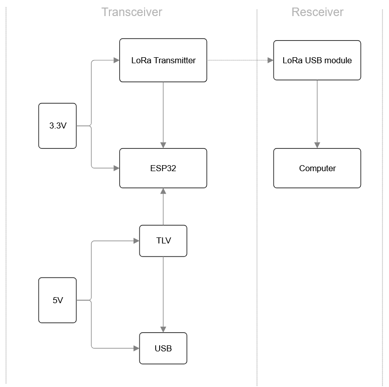
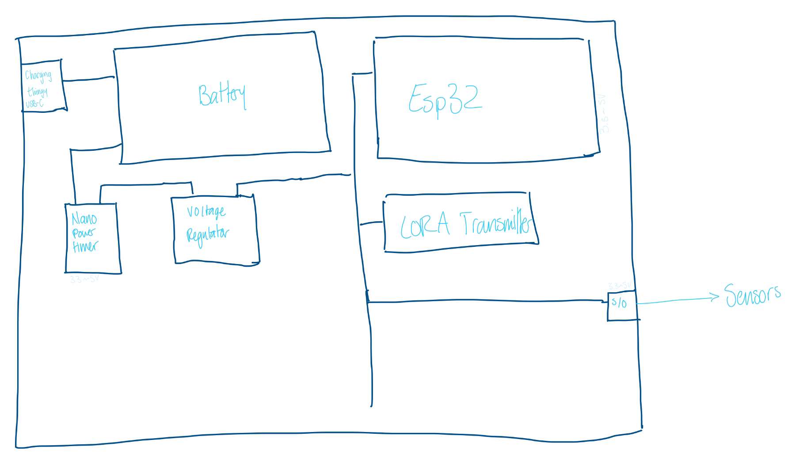
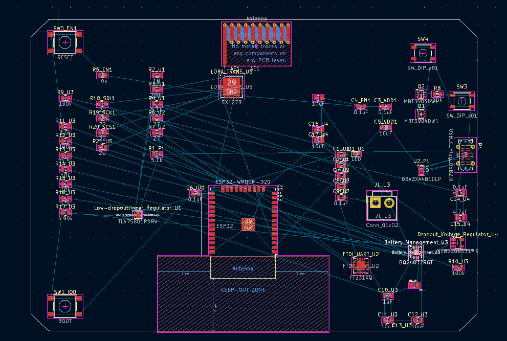
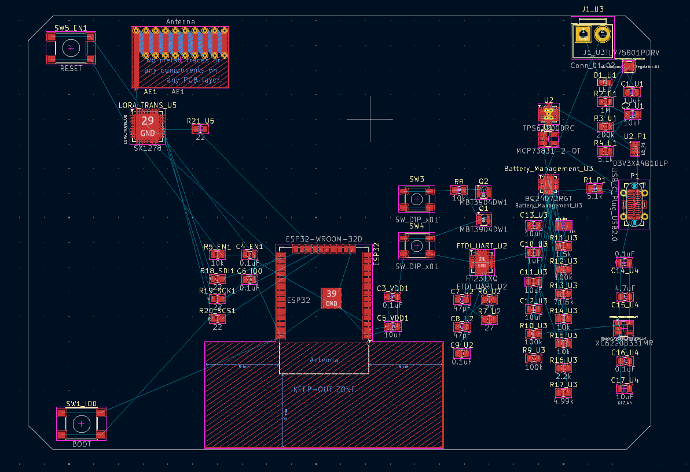
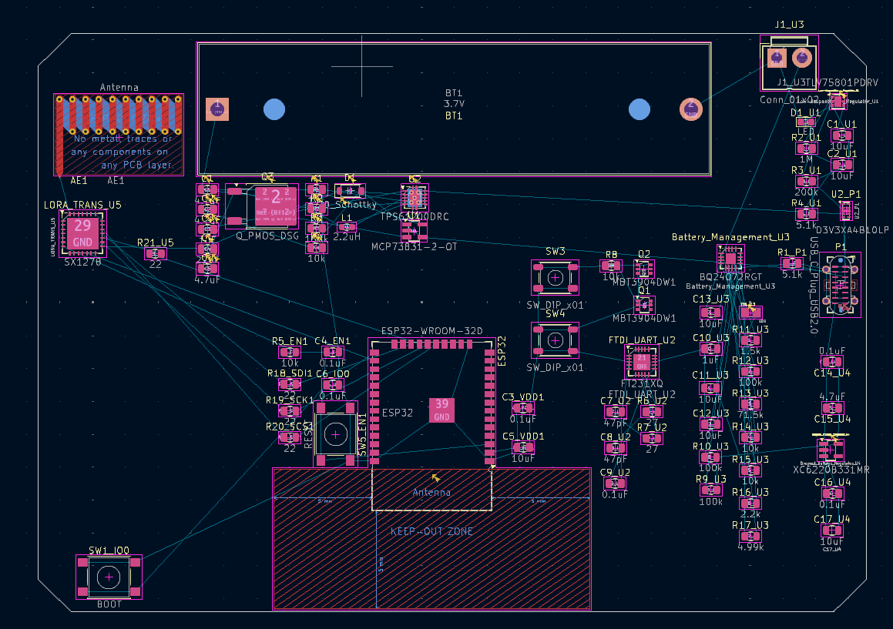
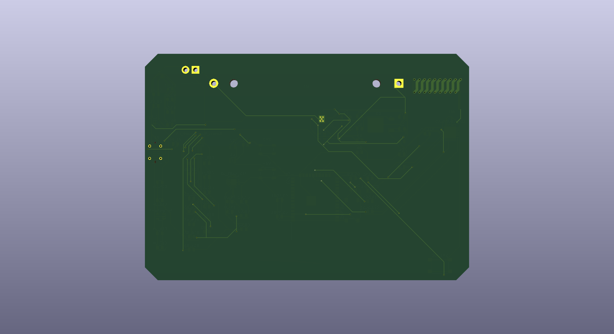
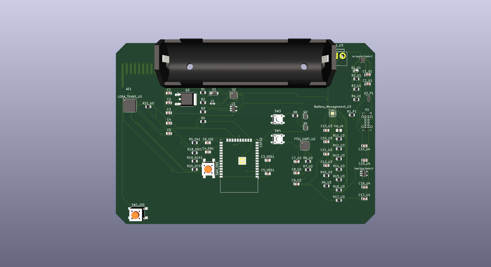
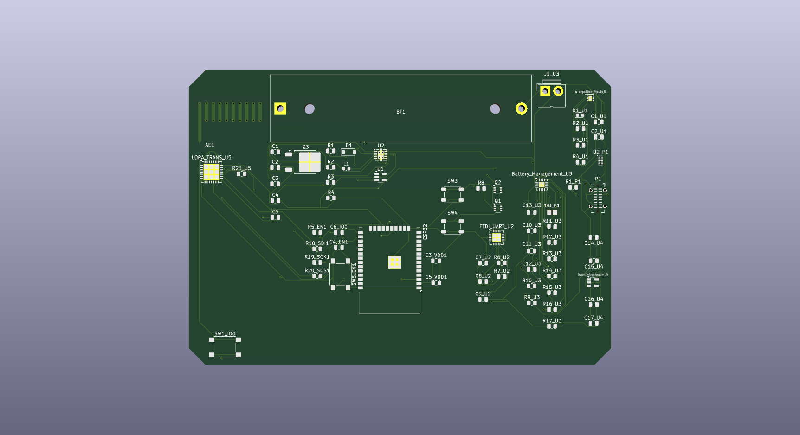
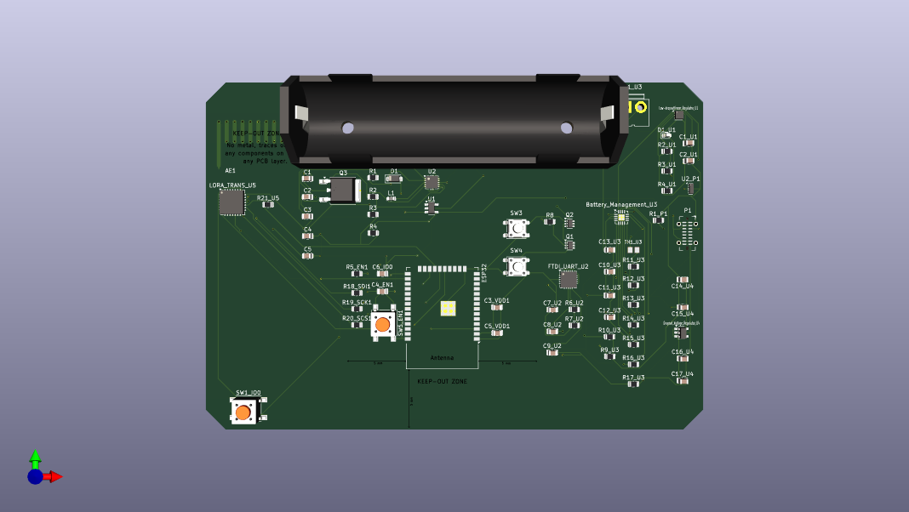

# Smart Waste Management System

A LoRa-based system that monitors garbage bin capacity in real time, aiming to improve collection efficiency and prevent overflow. Built through a Catalyst Entrepreneurship project (an optional, non-compulsory program, not coursework).

**Team:** Badi Daoud, Jay S., Kenneth Martinez, Mithuran
**My role:** hardware design (PCB placement and routing in KiCad/Altium) and mechanical enclosure design (SolidWorks)

> This repository is my personal record of a four-person team project. It documents the project honestly, including the gaps in what survived (no firmware source, no recovered presentation), and credits every teammate's contribution; it is not a claim of solo authorship.

## Table of Contents

- [Overview](#overview)
- [Team and Roles](#team-and-roles)
- [System Architecture](#system-architecture)
- [Design Process](#design-process)
- [Hardware](#hardware)
- [Final Product](#final-product)
- [Mechanical and Enclosure Design](#mechanical-and-enclosure-design)
- [My Contributions](#my-contributions)
- [Repository Contents](#repository-contents)
- [Known Gaps](#known-gaps)

## Overview

Municipal and commercial waste collection is often run on a fixed schedule rather than actual need, which means trucks visit bins that are barely full and miss ones that overflow between visits. This project's goal was a low-cost, low-power sensor node that reports how full a bin is over a long-range wireless link, so collection can be routed by actual capacity instead of a fixed route.

The core approach: a battery-powered ESP32 node with a capacity sensor sits in or on the bin and reports readings over LoRa to a receiving USB module connected to a computer, which logs bin status without needing local WiFi or cellular coverage at the bin site.

## Team and Roles

This was a 4-person team project through a Catalyst Entrepreneurship program:

- **Jay S.** wrote the ESP32 firmware.
- **Kenneth Martinez** was the most experienced member of the team; he reviewed everyone's work across the board and presented the project.
- **Mithuran** contributed to reviewing work where he could.
- **Badi Daoud (me)** designed the hardware, PCB placement and routing, and the mechanical enclosure.

## System Architecture



*Signal and power path: a 3.3V rail feeds the LoRa transmitter and the ESP32, while a separate 5V rail runs through a TLV regulator and USB interface. The ESP32 drives the LoRa transmitter, which reports wirelessly to a receiving LoRa USB module connected to a computer.*

## Design Process

The design started as a hand-drawn concept sketch before any schematic work began:


*Early concept sketch: USB-C charging into a battery, routed through a nano power timer and voltage regulator to power the ESP32, which drives the LoRa transmitter on one side and reads sensor input through I/O on the other.*

I learned KiCad from scratch in under 20 days to take this from that sketch to an actual routable board, working through component placement, connections, and an antenna keep-out zone for the LoRa module.

## Hardware

The board centers on an ESP32-WROOM-32D, a LoRa transceiver (SX1278), a BQ24072-based battery management/charging circuit, an FTDI UART interface for programming, and a set of switches/DIP pins for configuration. The full KiCad project is in [`hardware/kicad/`](hardware/kicad/), including the completed PCB layout, not just screenshots:

| File | Sheet | Contents |
|---|---|---|
| [`LoRa_schematic.kicad_sch`](hardware/kicad/LoRa_schematic.kicad_sch) | Root | ESP32-WROOM-32D, SX1278 LoRa transceiver, antenna, and configuration switches |
| [`untitled.kicad_sch`](hardware/kicad/untitled.kicad_sch) | USB in | USB-C input, MCP73831 Li-ion charger, TPS61200 boost converter, PMOS load switch |
| [`TLV.kicad_sch`](hardware/kicad/TLV.kicad_sch) | TLV (Regulator) | TLV75801 LDO regulator, FT231XQ USB-UART bridge for programming, status LED |
| [`power_block.kicad_sch`](hardware/kicad/power_block.kicad_sch) | Power block | BQ24072 battery management/charging, XC6220 3.3V regulator, thermistor |
| [`LoRa_schematic.kicad_pcb`](hardware/kicad/LoRa_schematic.kicad_pcb) | — | The routed PCB layout |
| [`LoRa_schematic.kicad_pro`](hardware/kicad/LoRa_schematic.kicad_pro) | — | KiCad project file tying the sheets together |

The screenshots below are from the KiCad PCB editor during layout, showing component placement and ratsnest connections as the design came together.

<table>
<tr>
<td></td>
<td></td>
</tr>
<tr>
<td align="center"><em>Early placement pass: ESP32-WROOM-32D, LoRa transceiver, and surrounding passives with unrouted ratsnest connections</em></td>
<td align="center"><em>Reorganized placement: components regrouped for shorter, cleaner routing paths</em></td>
</tr>
</table>


*Detail view showing the charging circuit (MCP73831), boost converter (TPS61070), battery footprint, and the antenna keep-out zone required around the LoRa module (no copper or components permitted in that region).*

## Final Product

<table>
<tr>
<td></td>
<td></td>
</tr>
<tr>
<td align="center"><em>Bare board copper layer, unpopulated</em></td>
<td align="center"><em>Populated board: battery holder, ESP32 module, LoRa module, buttons, and status LED</em></td>
</tr>
<tr>
<td></td>
<td></td>
</tr>
<tr>
<td align="center"><em>Populated board, alternate viewing angle</em></td>
<td align="center"><em>Populated board, isometric view</em></td>
</tr>
</table>

## Mechanical and Enclosure Design

The sensor node needed a physical enclosure that could mount inside or on a waste bin. I designed this in SolidWorks; the source files are in [`mechanical/`](mechanical/):

| File | Description |
|---|---|
| [`1_bin_lid.SLDPRT`](mechanical/1_bin_lid.SLDPRT) | Bin lid part |
| [`1_slot_bin.SLDPRT`](mechanical/1_slot_bin.SLDPRT) | Individual slot bin part |
| [`bins_combined_with_lids.SLDASM`](mechanical/bins_combined_with_lids.SLDASM) | Assembly combining multiple bins with their lids |
| [`outside_box.SLDPRT`](mechanical/outside_box.SLDPRT) | Outer enclosure box |

No rendered preview images survived for these parts; they're included here as source files only. Anyone with SolidWorks (or a compatible viewer) can open them directly.

## My Contributions

My individual work on the team covered:

- Took the team's initial hand-sketched concept and turned it into an actual KiCad schematic and PCB layout, learning KiCad from the ground up in under 20 days.
- Placed and routed the board: ESP32-WROOM-32D, LoRa transceiver (SX1278), BQ24072 battery management/charging circuit, TPS61070 boost regulator, and the FTDI programming interface, including the antenna keep-out zone required around the LoRa module.
- Designed the physical enclosure in SolidWorks: the bin lid, individual slot bin, combined multi-bin assembly, and outer box.

## Repository Contents

```
.
├── README.md
├── assets/                              Figures used in this README
├── hardware/
│   └── kicad/                            Full KiCad project: schematic sheets and routed PCB layout
└── mechanical/                          SolidWorks source files for the enclosure
    ├── 1_bin_lid.SLDPRT
    ├── 1_slot_bin.SLDPRT
    ├── bins_combined_with_lids.SLDASM
    └── outside_box.SLDPRT
```

## Known Gaps

In the interest of being upfront about what this repository does and doesn't contain:

- The ESP32 firmware was written and flashed by a teammate directly from his own computer; no firmware source files exist to include here.
- The project presentation was lost after a teammate deleted it, and no copy has been recovered.
